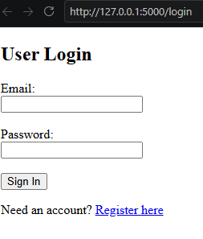
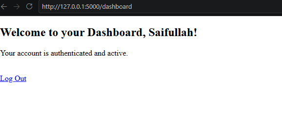

# Flask Authentication & Registration Portal

A secure user authentication and management web application built using Python and Flask. The application handles end-to-end user lifecycles—from account registration with time-sensitive token verification to session-based route protection and encrypted password storage.

---

## Key Features

- **Form Validation & User Registration:** Validates inputs and prevents duplicate email registrations.
- **Email Verification Flow:** Uses cryptographic, time-limited tokens to confirm user email addresses before activating access.
- **Secure Password Hashing:** Uses `werkzeug.security` (PBKDF2/SHA-256) to ensure plaintext passwords are never stored.
- **Session Management:** Secures user states using cryptographically signed session cookies.
- **Protected Routing & Logout:** Restricts dashboard access to active sessions and terminates credentials completely upon logout.

---

## Tech Stack

| Component | Technology / Library | Purpose |
| :--- | :--- | :--- |
| **Backend** | Python 3.x | Core programming language |
| **Framework** | Flask | Routing, templating, and HTTP request handling |
| **Security** | Werkzeug (`security`) | One-way password hashing and verification |
| **Tokens** | itsdangerous | Time-sensitive cryptographic token serialization |
| **Frontend** | Jinja2, HTML5 | Dynamic UI rendering and server-side templates |

---

## Installation & Setup

### Prerequisites
Ensure you have Python 3.8+ installed on your system.

### 1. Clone the Repository
```bash
git clone [https://github.com/SaifAhmedl/flask-auth-portal.git](https://github.com/SaifAhmedl/flask-auth-portal.git)
cd flask-auth-portal
```

### 2. Set Up a Virtual Environment (Recommended)
```bash
# Windows
python -m venv venv
venv\Scripts\activate

# Linux/macOS
python3 -m venv venv
source venv/bin/activate
```

### 3. Install Dependencies
```bash
pip install -r requirements.txt
```

### 4. Run the Application
```bash
python app.py
```
The server will start locally at:
```text
[http://127.0.0.1:5000/](http://127.0.0.1:5000/)
```

---

## Usage & Application Workflow

1. **Register:** Navigate to `/register` and submit username, email, and password.
2. **Verify:** Check the running terminal for the simulated token link (or open the provided confirmation link) to activate the account.
3. **Log In:** Go to `/login` with your verified credentials.
4. **Access Dashboard:** View the protected `/dashboard` page.
5. **Log Out:** Click "Log Out" to destroy the session and verify that protected routes redirect back to login.

---

## Screenshots

| Registration Page | Dashboard (Authenticated) |
| :---: | :---: |
|  |  |

*(To see a live demo locally, follow the Installation steps above).*
